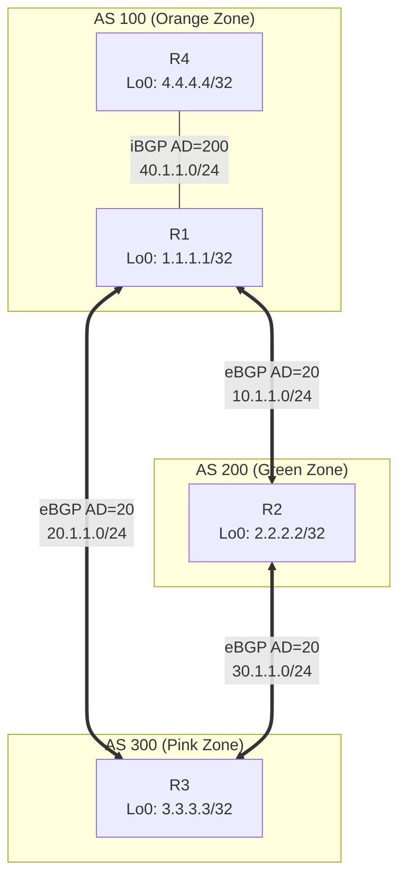

# 🌐 BGP 3-Router Topology & Packet Exchange Diagrams
## Project: `bgp-simulator` (AS 100, AS 200, AS 300)

---

## 1. Network Topology & Peering Architecture

---

## 2. BGP Peering Session Establishment & UPDATE Sequence

```mermaid
sequenceDiagram
    autonumber
    actor Admin as Network Engineer
    participant R1 as R1 (AS 100)
    participant R2 as R2 (AS 200)

    rect rgb(30, 41, 59)
        Note over R1, R2: Phase 1: TCP Handshake & BGP OPEN
        R1->>R2: TCP Syn (Port 179)
        R2-->>R1: TCP Syn-Ack
        R1->>R2: BGP OPEN (My AS: 100, HoldTime: 180, BGP ID: 1.1.1.1)
        R2->>R1: BGP OPEN (My AS: 200, HoldTime: 180, BGP ID: 2.2.2.2)
        R1-->>R2: BGP KEEPALIVE
        R2-->>R1: BGP KEEPALIVE
        Note over R1, R2: State Transitions: Idle -> Connect -> OpenSent -> OpenConfirm -> ESTABLISHED
    end

    rect rgb(15, 23, 42)
        Note over R1, R2: Phase 2: Route Exchange (UPDATE Messages)
        R1->>R2: BGP UPDATE (Adv: 1.1.1.1/32, NextHop: 10.1.1.1, AS-Path: [100])
        R2->>R1: BGP UPDATE (Adv: 2.2.2.2/32, NextHop: 10.1.1.2, AS-Path: [200])
        Note over R1: R1 installs 2.2.2.2/32 in BGP Table (*> eBGP AD=20)
        Note over R2: R2 installs 1.1.1.1/32 in BGP Table (*> eBGP AD=20)
    end

    rect rgb(20, 30, 50)
        Note over R1, R2: Phase 3: Periodic Heartbeats
        loop Every 3 seconds
            R1->>R2: BGP KEEPALIVE
            R2->>R1: BGP KEEPALIVE
        end
    end
```

