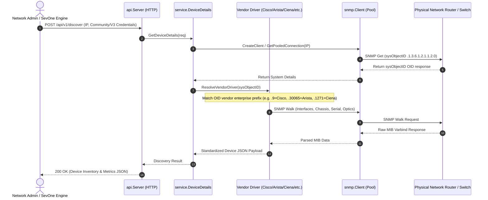
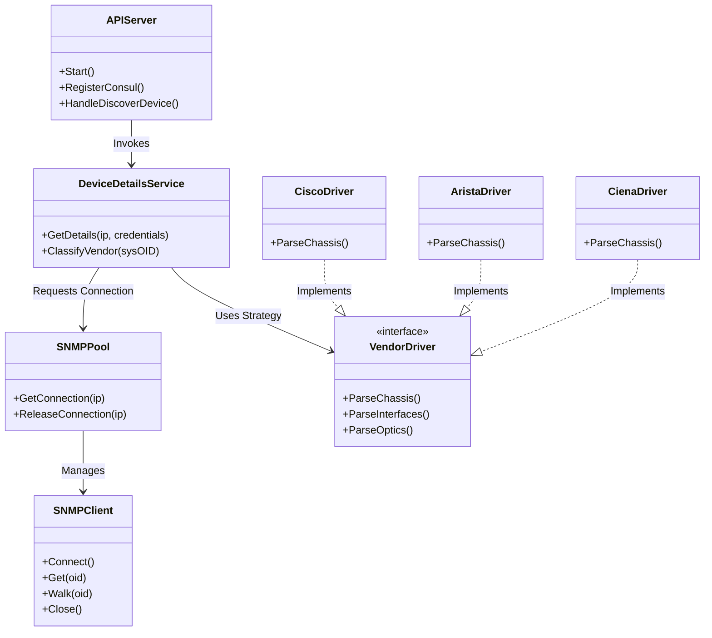

# Architectural Analysis & Technical Documentation
## Project: `discovery-snmp-api`
**Location**: `/Volumes/mobile/sevone/github/disc/discovery-snmp-api`

---

## 🛠 How to Perform This Analysis Yourself (Tutorial)

When you start working on a new repository or project (in Java, Go, Python, etc.), you can run two main `gstack` workflows:

### Workflow 1: Architectural Engineering Review (`/plan-eng-review`)
1. **Prompt to AI**: 
   > `/plan-eng-review /Volumes/mobile/sevone/github/disc/discovery-snmp-api`
2. **What AI does**:
   - Analyzes package boundaries, separation of concerns (API, Business Logic, Protocol Drivers).
   - Evaluates Object-Oriented/Interface abstractions (e.g. `SNMP Client` interfaces vs `Vendor Service` implementations).
   - Identifies design patterns (Factory Pattern, Worker Pools, Connection Caching, Adapter Pattern).
   - Highlights scalability, thread safety, and extensibility.

### Workflow 2: Technical Documentation & Flowcharts (`/document-generate` & `/diagram`)
1. **Prompt to AI**:
   > `/diagram /Volumes/mobile/sevone/github/disc/discovery-snmp-api`
2. **What AI does**:
   - Generates **Mermaid Sequence & Class Diagrams** showing how HTTP API requests flow down to SNMP workers and vendor parsers.
   - Generates structured Markdown documentation with package responsibilities and API routes.

---

## 🏗 Part 1: Architectural Engineering Analysis (`/plan-eng-review`)

### 1. High-Level Architecture Overview
`discovery-snmp-api` is a high-performance **SNMP Discovery Service** written in Go. It acts as an automated network discovery broker that queries multi-vendor hardware (Cisco, Arista, Ciena, DriveNets, Nokia, NVIDIA, SONiC, Dell) via SNMP v2c/v3, parses hardware metadata, and registers service endpoints via Consul.

```
[ HTTP REST Clients / SevOne ]
              │
              ▼
   ┌──────────────────────┐
   │     api/ Package     │ (HTTP Router, Consul Registry, Health)
   └──────────┬───────────┘
              │
              ▼
   ┌──────────────────────┐
   │   service/ Package   │ (Device Details Orchestrator & Vendor Drivers)
   └──────────┬───────────┘
              │
    ┌─────────┴─────────┐
    ▼                   ▼
┌───────────────┐   ┌───────────────────────────┐
│ parser/       │   │ snmp/ Engine              │
│ Vendor Parsing│   │ Connection Pool & Worker  │
└───────────────┘   │ Cache & v2c/v3 Sessions   │
                    └───────────────────────────┘
```

### 2. Core Package Responsibilities & Design Patterns

| Package | Primary Responsibility | Key Design Patterns Used |
| :--- | :--- | :--- |
| **`cmd/`** | CLI bootstrapping and server initiation | Command Pattern (`cobra`) |
| **`api/`** | REST API endpoints, HTTP server, Consul service discovery registration | Controller / Transport Layer |
| **`service/`** | Vendor-specific hardware discovery (`cisco.go`, `arista.go`, `ciena.go`, `drivenets.go`, `nokia.go`, `nvidia.go`, `sonic.go`, `dell.go`) | **Strategy / Adapter Pattern**: Pluggable vendor handlers for device classification |
| **`snmp/`** | Low-level SNMP Engine (`client.go`, `connection.go`, `pool.go`, `cache.go`, `v2.go`, `v3.go`) | **Factory & Connection Pool Pattern**: Thread-safe SNMP session reuse & concurrency control |
| **`parser/`** | Raw SNMP Walk payload parsing and MIB OID extraction | Parser / Sanitizer |
| **`monitoring/`** | Prometheus metrics & health probes | Observer Pattern |

---

## 📊 Part 2: Technical Diagrams & Sequence Flow (`/diagram`)

### 1. End-to-End System Sequence Diagram



### 2. Package Dependency & Class Structure



---

## 🎯 Key Architectural Takeaways

1. **High Concurrency & Session Pooling**: The `snmp/pool.go` and `snmp/cache.go` implement thread-safe connection pooling to prevent socket exhaustion when polling thousands of network devices concurrently.
2. **Pluggable Vendor Extensibility**: Adding support for a new hardware vendor (e.g. Huawei or Juniper) requires only creating a new driver file in `service/` implementing the vendor parser interface without touching the core HTTP API server.
3. **Consul Integration**: Automatically registers microservice instances with Consul for high availability and dynamic service discovery in Kubernetes/datacenter clusters.
