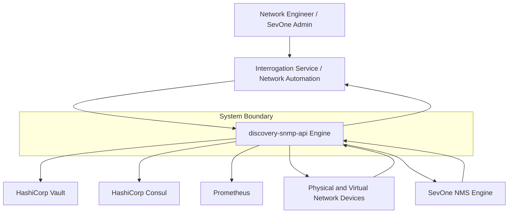
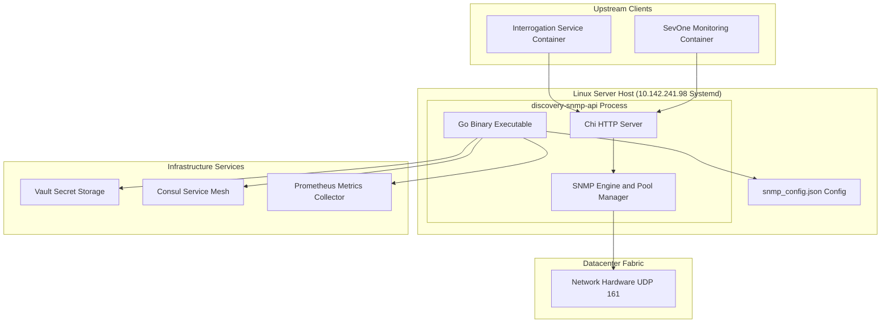
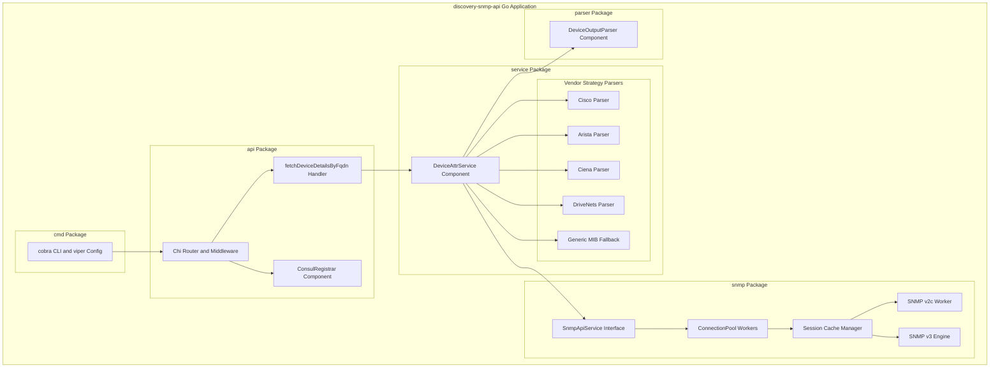
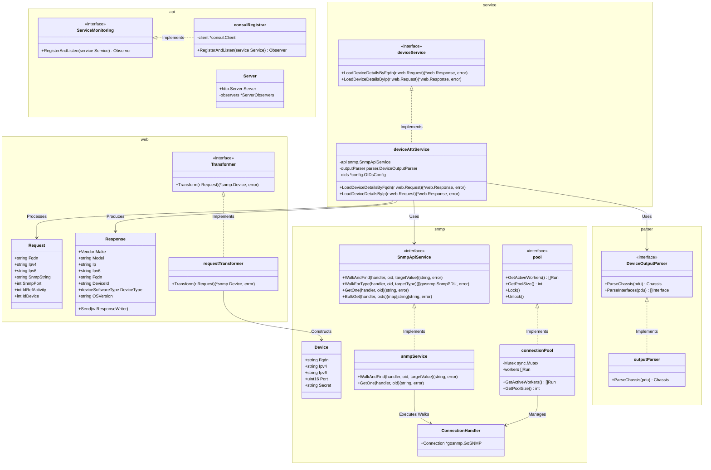
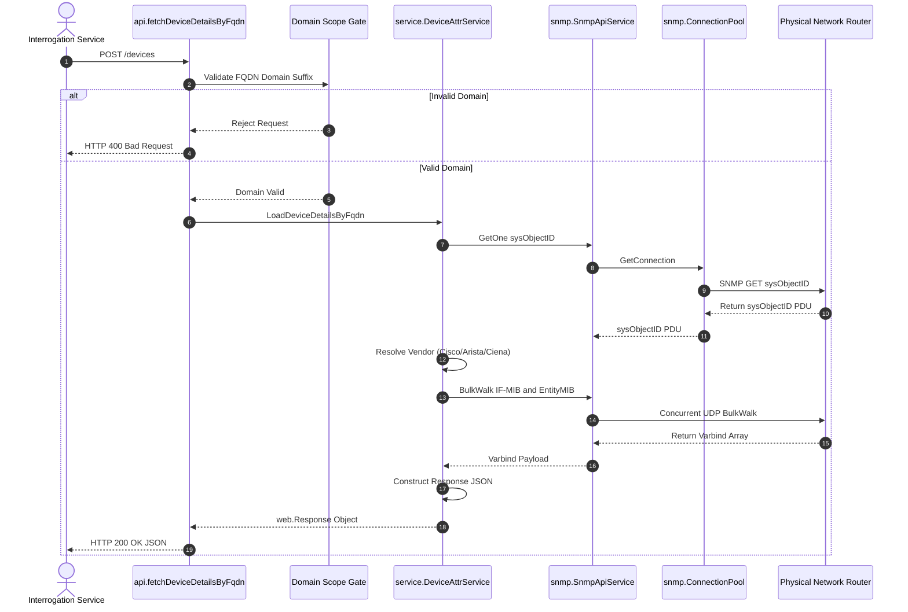

# 🏛 C4 Architecture Model & Visual Diagrams
## Microservice: `discovery-snmp-api`
**Location**: `/Volumes/mobile/sevone/github/disc/discovery-snmp-api`

---

## 🎨 C4 Visual Architecture Diagram

---

## 1. C4 Level 1: System Context Diagram

---

## 2. C4 Level 2: Container Diagram

---

## 3. C4 Level 3: Component Diagram

---

## 4. C4 Level 4: Code & Class Relationship Diagram

The C4 Level 4 diagram details Go structs, interfaces, methods, and their relationships across packages.

---

## 5. C4 Level 4: Execution Sequence Flow Diagram

