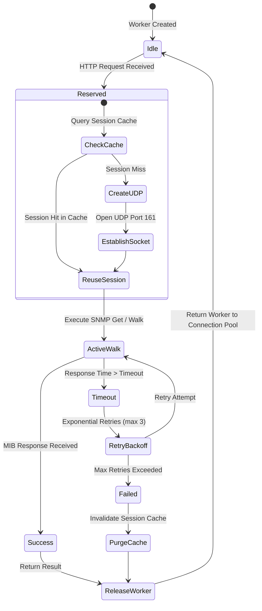
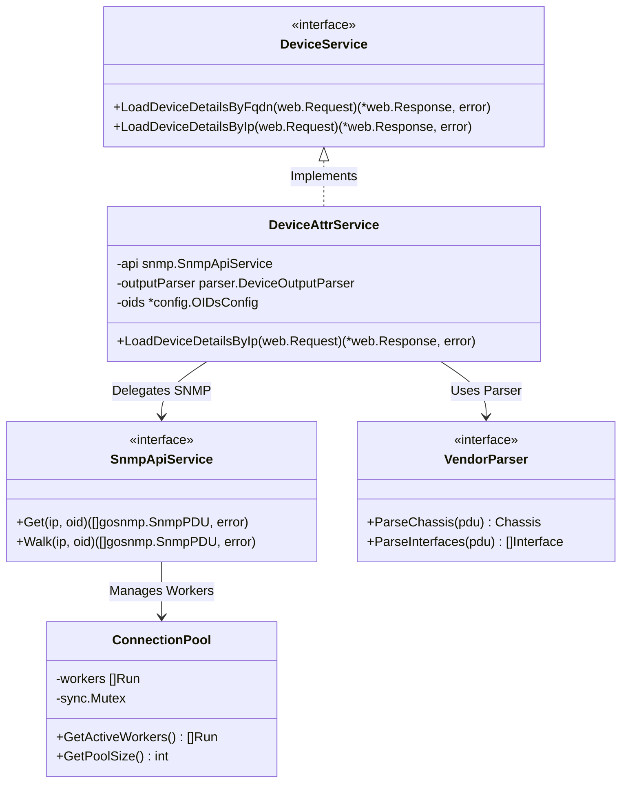

# 🎨 gstack `/diagram` Analysis
## System Visualizations: `discovery-snmp-api`
**Location**: `/Volumes/mobile/sevone/github/disc/discovery-snmp-api`

---

## 1. High-Level Microservice Architecture Diagram

This diagram shows how external clients (SevOne/HTTP REST) interact with the API layer, Consul registration, vendor dispatchers, and low-level UDP SNMP engines.

```mermaid
graph TD
    subgraph External Clients & Infrastructure
        SevOne["SevOne Monitoring Engine / REST Client"]
        Consul["HashiCorp Consul Service Discovery"]
        Prometheus["Prometheus Metrics Scraper"]
    end

    subgraph API Layer (api/)
        Router["Chi HTTP Router (:8080)"]
        HealthEndpoint["/health Endpoint"]
        MetricsEndpoint["/metrics Endpoint"]
        DiscoverEndpoint["POST /api/v1/discover"]
        ConsulAgent["Consul Registration Agent"]
    end

    subgraph Domain & Vendor Dispatcher (service/)
        Orchestrator["DeviceDetails Service"]
        VendorResolver["Vendor Strategy Resolver (sysObjectID)"]
        
        subgraph Vendor Drivers
            Cisco["Cisco Driver"]
            Arista["Arista Driver"]
            Ciena["Ciena Driver"]
            DriveNets["DriveNets Driver"]
            Nokia["Nokia Driver"]
            NVIDIA["NVIDIA Driver"]
            SONiC["SONiC Driver"]
            Dell["Dell Driver"]
        end
    end

    subgraph SNMP Engine & Protocol Layer (snmp/ & parser/)
        SNMPPool["SNMP Connection Pool"]
        WorkerCache["Worker Session Cache"]
        SNMPv2c["SNMP v2c Engine"]
        SNMPv3["SNMP v3 Engine (USM)"]
        VarbindParser["MIB Varbind Output Parser"]
    end

    subgraph Physical Network Infrastructure
        Routers["Core Routers (Cisco / Arista / Juniper)"]
        Switches["Data Center Switches (DriveNets / SONiC)"]
        Firewalls["Edge Firewalls & Load Balancers"]
    end

    %% Flow connections
    SevOne -->|HTTP REST Request| DiscoverEndpoint
    Prometheus -->|Scrapes Metrics| MetricsEndpoint
    ConsulAgent -->|Registers Service| Consul

    DiscoverEndpoint --> Orchestrator
    Orchestrator --> VendorResolver
    VendorResolver --> Cisco & Arista & Ciena & DriveNets & Nokia & NVIDIA & SONiC & Dell

    Orchestrator --> SNMPPool
    SNMPPool --> WorkerCache
    WorkerCache --> SNMPv2c & SNMPv3
    SNMPv2c & SNMPv3 -->|UDP Port 161| Routers & Switches & Firewalls
    
    Routers & Switches & Firewalls -->> VarbindParser : Raw MIB PDU Response
    VarbindParser -->> Orchestrator : Standardized JSON Payload
    Orchestrator -->> DiscoverEndpoint : HTTP 200 JSON Response
```

---

## 2. End-to-End Device Discovery Sequence Diagram

This sequence diagram details the step-by-step execution flow during a device discovery API call (`POST /api/v1/discover`).

```mermaid
sequenceDiagram
    autonumber
    actor Admin as Network Engineer / SevOne Poller
    participant HTTP as api.Server (chi Router)
    participant Service as service.DeviceAttrService
    participant Pool as snmp.ConnectionPool
    participant UDP as snmp.Client (UDP Socket)
    participant Device as Physical Switch / Router
    participant Parser as parser.DeviceOutputParser

    Admin->>HTTP: POST /api/v1/discover { "ip": "10.100.1.1", "version": "v2c", "community": "public" }
    HTTP->>Service: LoadDeviceDetailsByIp(req)
    
    Service->>Pool: GetConnection("10.100.1.1")
    Pool->>UDP: Initialize / Retrieve Pooled UDP Session
    
    rect rgb(30, 41, 59)
        Note over Service, Device: Step A: Initial sysObjectID Probe
        Service->>UDP: Get(".1.3.6.1.2.1.1.2.0") [sysObjectID]
        UDP->>Device: SNMP GET PDU (.1.3.6.1.2.1.1.2.0)
        Device-->>UDP: Return sysObjectID (e.g. .1.3.6.1.4.1.9.1.2223)
        UDP-->>Service: sysObjectID OID
    end

    rect rgb(15, 23, 42)
        Note over Service, Parser: Step B: Vendor Driver Selection & Full Walk
        Service->>Service: Identify Vendor (e.g. .9 = Cisco Enterprise)
        Service->>UDP: Walk(IF-MIB, EntityMIB, ChassisOIDs)
        UDP->>Device: Bulk SNMP Walk Requests
        Device-->>UDP: MIB Varbind Result List
        UDP-->>Parser: Send Raw Varbind Payload
        Parser-->>Service: Structured JSON (Hostname, Serial, Ports, Optics)
    end

    Service-->>HTTP: Return DeviceDetails Response
    HTTP-->>Admin: 200 OK (Device Hardware & Port Telemetry)
```



---

## 3. SNMP Connection Pool & Worker State Flowchart

This state machine visualizes how `snmp/pool.go` manages concurrent SNMP worker connections.



---

## 4. Class Relationship & Package Interface Architecture


