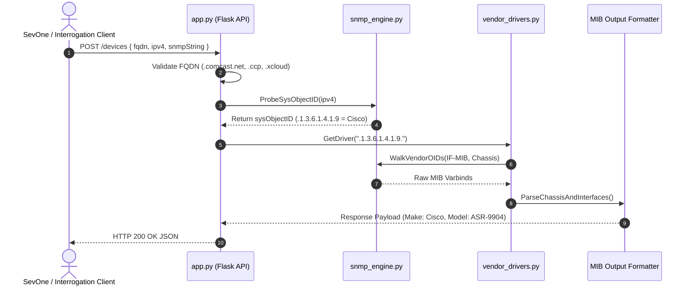

# 🏛 Python SNMP Simulator Architecture Diagrams
## Project: `snmp-simulator` (Python replacement for `discovery-snmp-api`)

---

## 1. System Context Diagram (Level 1)

```mermaid
graph TD
    SevOne["SevOne NMS / Interrogation Service"]
    
    subgraph SimulatorBoundary ["Python Simulator System Boundary"]
        PythonSimulator["Python SNMP Discovery Simulator<br/>(app.py :5050)"]
    end

    MockHardware["Simulated Datacenter Hardware<br/>(Cisco, Arista, Ciena, DriveNets, Nokia, SONiC)"]
    Prometheus["Prometheus / Metrics Reader"]

    SevOne -->|POST /devices JSON| PythonSimulator
    Prometheus -->|GET /metrics| PythonSimulator
    PythonSimulator -->|Simulated OID Walk| MockHardware
    MockHardware -->> PythonSimulator : Return MIB PDUs
    PythonSimulator -->> SevOne : Return Standardized JSON
```

---

## 2. Sequence Execution Flow (Level 4)


